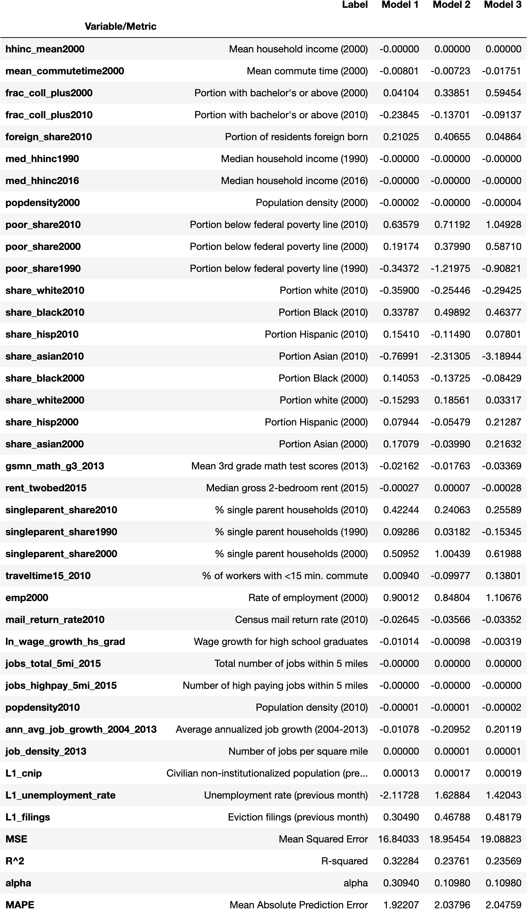

# Project 1 - Machine Learning
This is the template for the first project for ECON1680: Machine Learning, Text Analysis, and Economics. This project is meant to be an economic application of machine learning. Over the course of the project, you should fill in the following sections of the Readme.md file below with your research question and motivation, your data sources, your methods, your results, and instructions for replciation. 

## Research Question

**Can unemployment and socioeconomic data predict future eviction filings?**
Fueled by stagnating incomes and rising housing costs, America’s eviction epidemic has been brewing for years  (Desmond 2017). But today, renters face an entirely new threat: inflation (Ember 2022). With federal, state, and local governments unlikely to again implement rent freezes and eviction moratoriums, eviction filings will rise across the country, overwhelming food pantries, homeless shelters, and other community-based organizations that evicted tenants depend on (Bhattarai 2022). The ability to predict eviction at an extremely small geographic level could help CBOs anticipate spikes in demand for their services. 

## Data
I combine three sources of data to build my models. The first is the Eviction Tracking System at The Eviction Lab at Princeton University. Figure 1 maps the 4,349 census tracts for which I have access to monthly eviction filings data, aggregated by county for visibility.
My second source of data comes from the DEEP-MAPS project (Ghitza and Steitz 2020). The DEEP-MAPS model of the labor force uses data from the Current Population Survey and the Local Area Unemployment Statistics program to produce census tract-month level estimates of labor force statistics such as employment and the size of the labor force (see http://deepmaps.io for a detailed methodology).
Lastly, I use Opportunity Insights’ dataset of socioeconomic characteristics by census tract (Chetty et al. 2018).  Because these variables are correlated with economic outcomes, I hypothesize that many of them could be correlated with eviction rates. 

## Method
I attempt to predict eviction filings using unemployment rates and socioeconomic data using three different models. It is likely that observed characteristics such as household income, race, and median rent can explain much of the variation in eviction filings across space and time. I hypothesize that there is also unobserved variation in the data and that it stems from two key ways in which geographies differ. The first source of unobserved variation in eviction filings is differences in policy across census tracts. The second source of unobserved variation in eviction filings is cultural differences. For example, in some areas, landlords may be socialized to care more about the well-being of their tenants. These sources of unobserved variation are unlikely to vary across time. Cultural attitudes take decades to shift. And policy changes often occur over longer time frames than what I observe in my data. In other words, the context I study is well suited to fixed-effects models. 
	I estimate each of my models using ridge regression (Hoerl and Kennard 1970) for two reasons. First, because the ridge regression loss function penalizes coefficient magnitude, it is less likely to overfit my models to the training data. I have also selected features which I hypothesize are all to some extent correlated with the outcome; the second reason I estimate my models using ridge regression is that it is more suited to my data

## Results

## Replication Instructions
1. Download raw data 
   1. Download Opportunity Insights' "Neighborhood Characteristics by Census Tract" [here](https://opportunityinsights.org/data/)
   2. Download The Eviction Lab's "All Cities Census Tract/Zip Code" dataset [here](https://evictionlab.org/eviction-tracking/get-the-data/)
   3. Download DEEP-MAPS's census tract level data [here](https://deepmaps.io/data)
2. Clean raw data
   1. Set paths to raw data in clean_covariates.py, clean_evictions.py, and clean_unemployment_data.py
   2. Set paths to save cleaned data in clean_covariates.py, clean_evictions.py, and clean_unemployment_data.py
   3. Run each file
3. Build merged dataset
   1. Set paths to cleaned data and to output dataset location in build_dataset.py
   2. Run build_dataset.py
4. Run models
   1. Set paths to merged dataset and output paths in main.py
   2. Run main.py